# Results

## Seurat Normalized

##### SRP011546
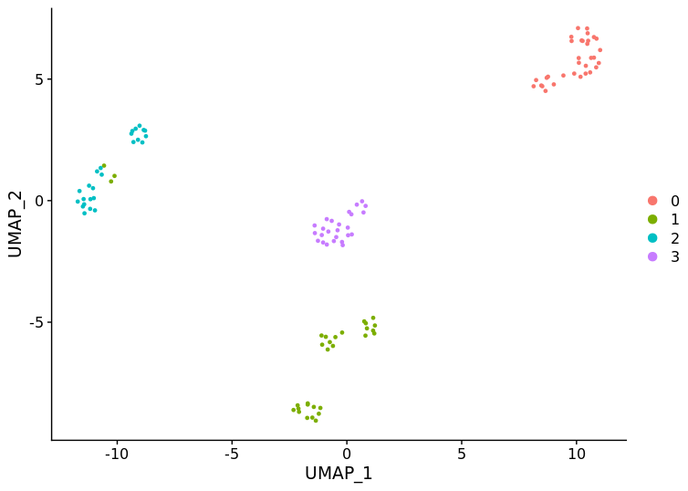   
##### SRP057196
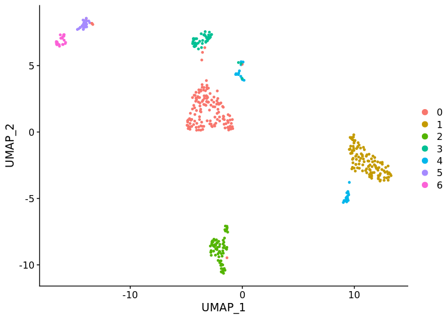   
##### SRP066632
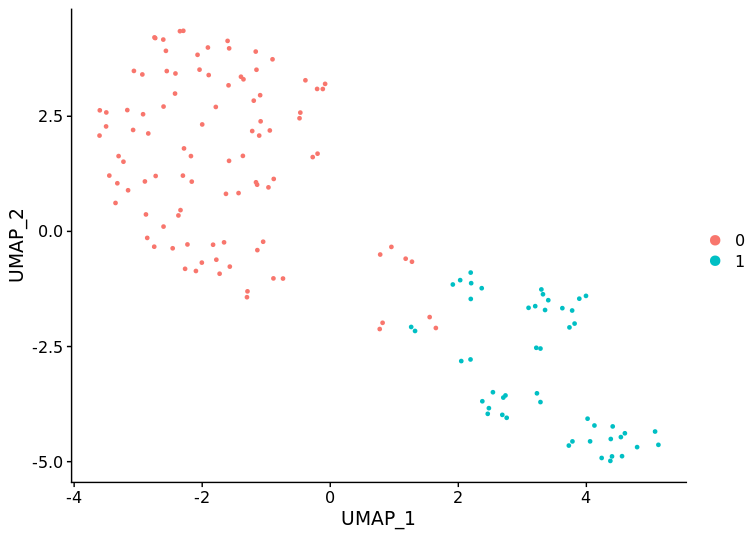      
##### SRP050499
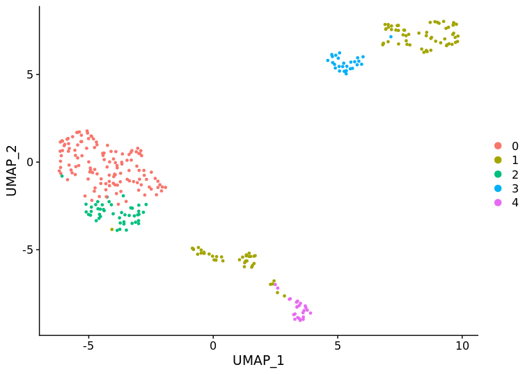     
##### SRP061549
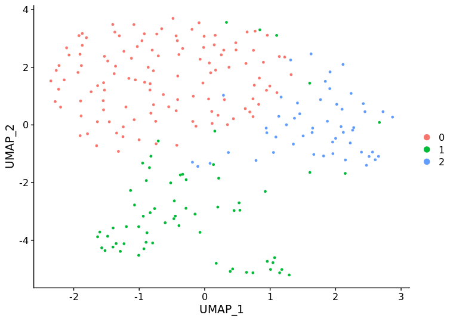  

## TPM Nornmalization

##### SRP011546
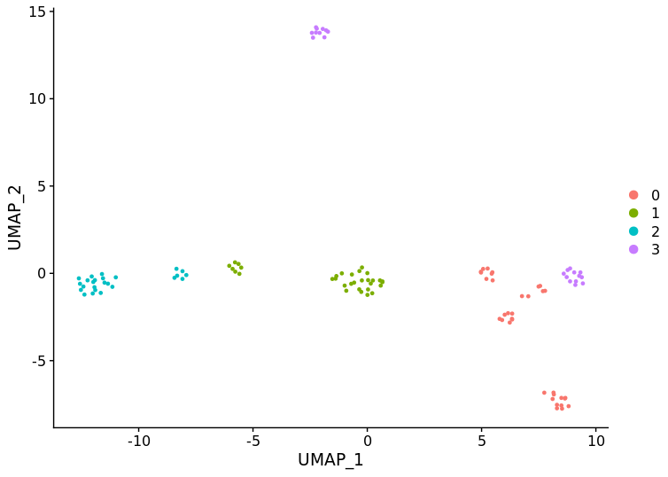      
##### SRP057196
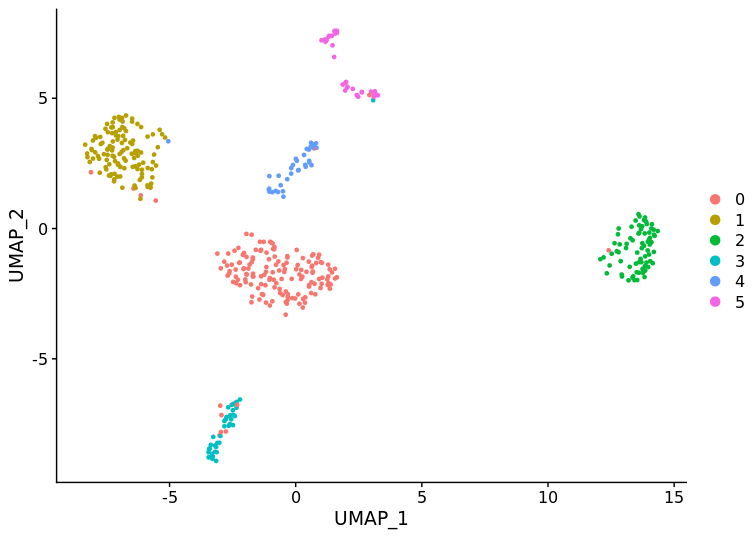      
##### SRP066632
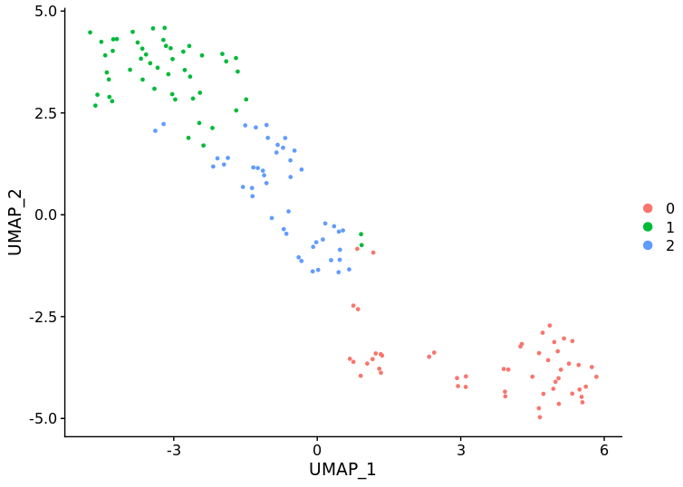
##### SRP050499
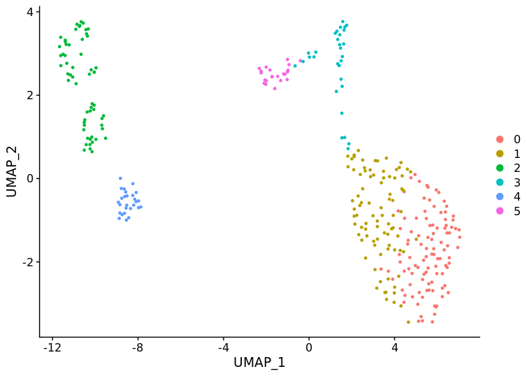
##### SRP061549
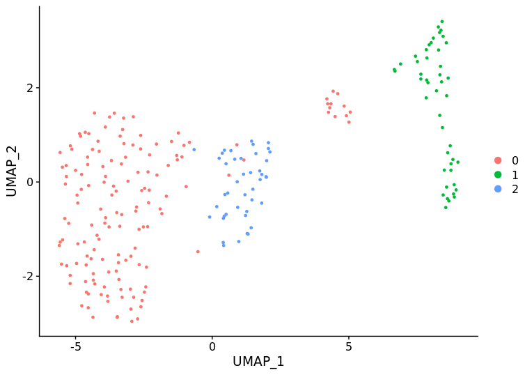   

## RPKM Normalization
##### SRP011546
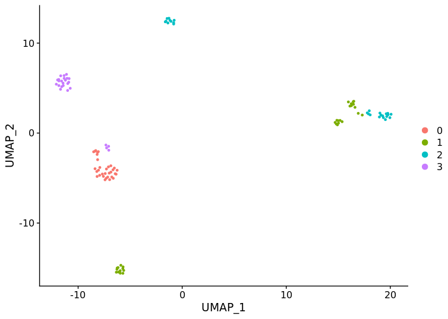
##### SRP057196
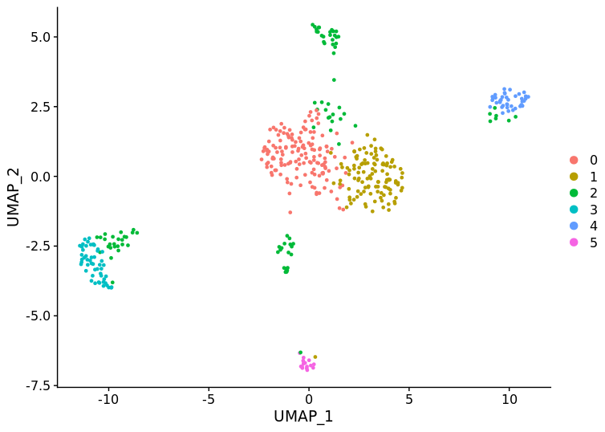
##### SRP066632

##### SRP050499
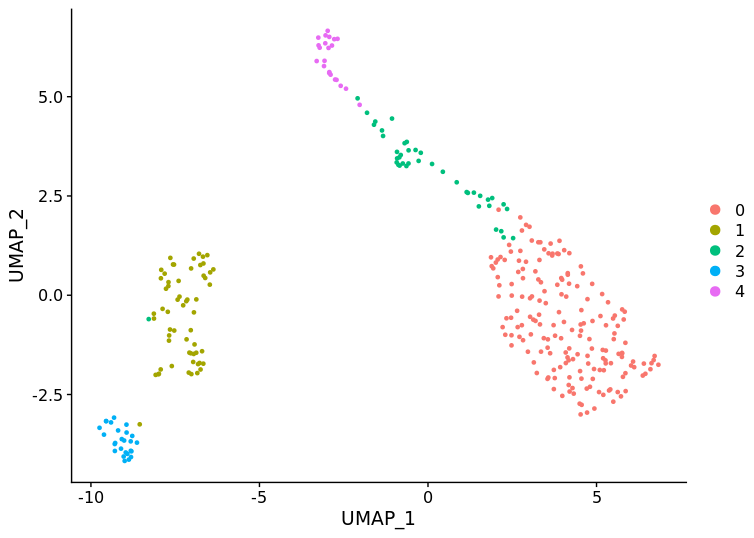
##### SRP061549
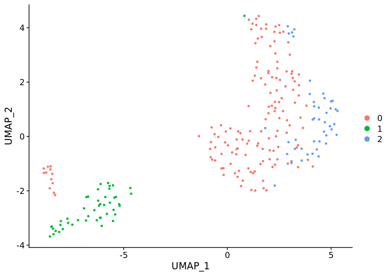
